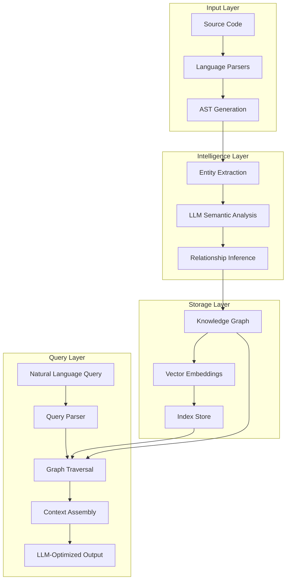

# Coretx - Intelligent Code Context Engine

[](https://www.python.org/downloads/)
[](https://opensource.org/licenses/MIT)
[](https://github.com/psf/black)

> **Coretx** (**Core** Con**tex**t) is an intelligent code analysis engine that builds comprehensive knowledge graphs of your codebase, enabling LLMs to understand and reason about code with minimal context.

## 📚 Table of Contents

- [Philosophy & Design](#-philosophy--design)
- [Why Coretx?](#-why-coretx)
- [Key Features](#-key-features)
- [Architecture Overview](#-architecture-overview)
- [Installation](#-installation)
- [Quick Start](#-quick-start)
- [API Reference](#-api-reference)
- [Core Concepts](#-core-concepts)
- [Query Language](#-query-language)
- [Output Specifications](#-output-specifications)
- [Advanced Usage](#-advanced-usage)
- [Performance](#-performance)
- [Contributing](#-contributing)
- [License](#-license)

## 🎨 Philosophy & Design

Coretx is built on three fundamental principles:

1. **Semantic First**: Code is more than syntax - it's about meaning, intent, and relationships
2. **Minimal Context**: LLMs perform best with exactly the right amount of information - no more, no less
3. **Universal Bridge**: Every codebase, regardless of language or framework, can be understood through a unified semantic model

The engine acts as an intelligent intermediary that:
- **Understands** your code's structure and semantics
- **Indexes** relationships and dependencies across languages
- **Retrieves** minimal logical closures for any query
- **Formats** context optimally for LLM consumption

## 🎯 Why Coretx?

When working with Large Language Models on code-related tasks, providing the right context is crucial. Too little context leads to incorrect solutions; too much overwhelms the model. Coretx solves this by:

1. **Building a semantic graph** of your entire codebase
2. **Understanding relationships** between code entities across languages
3. **Extracting minimal logical closures** - exactly what the LLM needs to understand the problem
4. **Formatting context optimally** for LLM consumption

## ✨ Key Features

### Core Capabilities
- **🧠 Semantic Code Understanding**: Uses LLMs to comprehend code intent and relationships
- **🕸️ Multi-Language Knowledge Graph**: Unified graph across Python, JS/TS, Java, C/C++, Go, Rust, and more
- **🎯 Surgical Context Extraction**: Returns exactly what's needed - no more, no less
- **🔍 Intelligent Query Engine**: Natural language queries over your codebase
- **📊 Rich Visualizations**: Interactive graph visualizations and beautiful terminal output

### Advanced Features
- **🔄 Incremental Updates**: Efficiently update the graph as code changes
- **🌐 Cross-Language Tracing**: Follow dependencies across language boundaries
- **🤖 LLM-Optimized Formatting**: Output specifically designed for LLM consumption
- **📈 Code Intelligence Metrics**: Complexity analysis, coupling detection, and more
- **🔌 Extensible Architecture**: Plugin system for custom analyzers and formatters


## 🏗️ Architecture Overview
### Diagram


### Component Details

1. **Parser Engine**: Tree-sitter based universal parsing with language-specific analyzers
2. **Semantic Analyzer**: LLM-powered understanding of code semantics and intent
3. **Graph Engine**: NetworkX-based graph with custom algorithms for code analysis
4. **Embedding Engine**: Vector representations for semantic search
5. **Query Processor**: Natural language to graph query translation
6. **Context Assembler**: Intelligent selection and formatting of relevant code


## 🚀 Installation

```bash
# From PyPI (coming soon)
pip install coretx

# From source (development)
git clone https://github.com/Whopus/Coretx.git
cd Coretx
pip install -e .
```

## 🎯 Quick Start

### Basic Setup

```python
from coretx import Coretx


# Initialize with your LLM configuration
ctx = Coretx(
    parser="auto",
    openai_api_key="your-api-key",
    openai_base_url="https://api.openai.com/v1"  # Optional
    model="gpt-4.1",
    embedding_model="text-embedding-small"
)

# Build knowledge graph of your codebase
graph = ctx.analyze("/path/to/project")

# Query the graph
result = ctx.query(graph, "What does the authentication system do?")
# or result = ctx.query("/path/to/project", "What does the authentication system do?"), graph will auto save in /path/to/project
print(result.summary)
print(result.code_context)

# Get minimal code context for solving problems
context = coretx.locate(graph, "Fix memory leak in user authentication")

# Trace dependencies across languages
deps = coretx.trace("PaymentService", direction="both")
```

### Load Existing Graph
```python
from coretx import Coretx, CodeGraph

# Initialize with your LLM configuration
ctx = Coretx(
    parser="auto",
    openai_api_key="your-api-key",
    openai_base_url="https://api.openai.com/v1"  # Optional
    model="gpt-4.1",
    embedding_model="text-embedding-small"
)

# Load existing graph
graph = CodeGraph("/path/to/project")

# Query the graph
result = ctx.query(graph, "What does the authentication system do?")
```

### Command Line Usage

```bash
# Initialize configuration
coretx init

# Analyze a project
coretx analyze /path/to/project

# Query the codebase
coretx query /path/to/project "Find all API endpoints"

# Find relevant code for a problem
coretx locate /path/to/project "Bug in payment processing"

# Interactive mode
coretx interactive /path/to/project
```


## 📖 API Reference

### Core APIs

#### `Coretx` Class

```python
class Coretx:
    def __init__(self, parser: str, openai_api_key: str, openai_base_url: str, model: str, **kwargs):
        """Initialize Coretx with LLM configuration."""
        
    def analyze(self, path: str, **options) -> CodeGraph:
        """Build a semantic knowledge graph of the codebase."""
        
    def query(self, question: str, **options) -> QueryResult:
        """Query the codebase using natural language."""
        
    def locate(self, path: str, problem: str) -> ContextResult:
        """Find minimal code context for a specific problem."""
        
    def trace(self, entity: str, direction: str = "both") -> TraceResult:
        """Trace dependencies of a code entity."""
```

#### `CodeGraph` Class

```python
class CodeGraph:
    @property
    def nodes(self) -> List[CodeEntity]:
        """All code entities in the graph."""
        
    @property
    def edges(self) -> List[Relationship]:
        """All relationships between entities."""
        
    def find_entity(self, name: str) -> Optional[CodeEntity]:
        """Find entity by name or path."""
        
    def get_dependencies(self, entity: CodeEntity) -> List[CodeEntity]:
        """Get all dependencies of an entity."""
        
    def get_dependents(self, entity: CodeEntity) -> List[CodeEntity]:
        """Get all entities that depend on this one."""
        
    def subgraph(self, entities: List[CodeEntity]) -> CodeGraph:
        """Extract a subgraph containing specified entities."""
```

### Query Result Objects

```python
@dataclass
class QueryResult:
    summary: str                    # Natural language summary
    code_context: str              # Formatted code context
    entities: List[CodeEntity]     # Relevant code entities
    relationships: List[Relationship]  # Relevant relationships
    confidence: float              # Query confidence score
    suggestions: List[str]         # Follow-up query suggestions
    
@dataclass
class ContextResult:
    minimal_closure: str           # Minimal code needed
    files: List[FileContext]       # File-by-file breakdown
    entry_points: List[CodeEntity] # Where to start reading
    flow_diagram: str              # ASCII/mermaid flow diagram
    fix_suggestions: List[str]     # Potential solutions
    
@dataclass
class CodeEntity:
    id: str                       # Unique identifier
    type: EntityType              # class, function, module, etc.
    name: str                     # Entity name
    path: str                     # File path
    line_start: int               # Starting line number
    line_end: int                 # Ending line number
    description: str              # Semantic description
    embedding: np.ndarray         # Vector representation
    metadata: Dict[str, Any]      # Language-specific metadata

@dataclass
class Relationship:
    id: str                       # Unique identifier
    type: RelationshipType        # import, invoke, call
    name: str                     # Entity name
    from: str                     # from file
    to: str                       # to file
    description: str              # Semantic description
    embedding: np.ndarray         # Vector representation [!important] relationship has semantic embedding
    metadata: Dict[str, Any]      # Language-specific metadata
```

## 📚 Core Concepts
### 1. Semantic Knowledge Graph

The knowledge graph captures three levels of understanding:

- **Syntactic Level**: AST-based structural relationships
- **Semantic Level**: LLM-inferred meaning and intent
- **Pragmatic Level**: Usage patterns and architectural role

Coretx builds a comprehensive graph where:
- **Nodes** represent code entities (classes, functions, modules)
- **Edges** represent relationships (imports, calls, inheritance)
- **Metadata** includes semantic descriptions and embeddings

### 2. Minimal Logical Closure

When extracting context, Coretx follows the principle of minimal sufficiency:

1. **Identify Focal Points**: Entities directly relevant to the query
2. **Expand Dependencies**: Include necessary dependencies for understanding
3. **Prune Redundancy**: Remove anything not essential
4. **Preserve Coherence**: Ensure the context is self-contained

When you query Coretx, it:
1. Converts your query to embeddings
2. Searches the graph for relevant nodes
3. Expands to include necessary dependencies
4. Returns the minimal set of code needed for understanding

### 3. Cross-Language Intelligence

Coretx understands relationships that span languages:

- API endpoints → Frontend consumers
- Database schemas → ORM models → API serializers
- Configuration files → Runtime behavior
- Build definitions → Deployment artifacts


## 🔍 Query Language

### Natural Language Queries

Coretx supports intuitive natural language queries:

```python
# Architecture queries
ctx.query(graph, "What is the overall architecture of this system?")
ctx.query(graph, "How do the frontend and backend communicate?")

# Bug localization
ctx.locate(graph, "Where might memory leaks occur in the authentication flow?")
ctx.locate(graph, "Find potential SQL injection vulnerabilities")
```


### Structured Queries

For more precise control:

```python
# Entity-based queries
ctx.find_entities(
    type=EntityType.CLASS,
    name_pattern="*Controller",
    has_annotation="@RestController"
)

# Relationship queries
ctx.find_paths(
    from_entity="UserService",
    to_entity="Database",
    max_depth=5
)
```

### Query Modifiers

```python
# Scope modifiers
ctx.query("Find all TODOs", scope="file:src/auth/*")
ctx.query("Security issues", scope="recent_changes")

# Output modifiers
ctx.query("API endpoints", output_format="openapi")
ctx.query("Database schema", output_format="mermaid")

# Analysis modifiers
ctx.query("Performance bottlenecks", analysis_depth="deep")
ctx.query("Quick code overview", analysis_depth="shallow")
```

## 📋 Example Output

### Analysis Output

When you run `Coretx.analyze()`, you'll see:

```
🔍 Analyzing codebase...
━━━━━━━━━━━━━━━━━━━━━━━━━━━━━━━━━━━━━━━━ 100% 0:00:42

📊 Analysis Complete!

📁 Files Processed: 156
📦 Total Entities: 1,247
🔗 Relationships Found: 3,892

🗂️  Language Breakdown:
   Python      █████████████████░░░  87 files  (55.8%)
   JavaScript  ████████░░░░░░░░░░░  42 files  (26.9%)
   HTML        ███░░░░░░░░░░░░░░░░  15 files  (9.6%)
   CSS         ██░░░░░░░░░░░░░░░░░  12 files  (7.7%)

🏗️  Entity Types:
   Classes     : 124
   Functions   : 486
   Methods     : 637
   Imports     : 892
   Variables   : 2,104

✨ Graph saved to: .coretx/project_graph.json
```

### Localization Output

$ coretx locate ./backend "Memory leak in authentication"

```
🎯 Localizing code for: "Fix memory leak in user authentication"

🔍 Analyzing query...
📍 Finding relevant code sections...
🔗 Building minimal context...

━━━━━━━━━━━━━━━━━━━━━━━━━━━━━━━━━━━━━━━━ 100% 0:00:03

📦 Minimal Logical Closure (4 files, 187 lines)

========================================
📄 FILE: backend/auth/manager.py
========================================
"""Authentication manager with session handling"""
from typing import Optional
from .session_store import SessionStore
from ..models.user import User

class AuthManager:
    def __init__(self):
        self.sessions = {}  # ⚠️ Potential memory leak - sessions never cleared
        self.session_store = SessionStore()
    
    def authenticate(self, username: str, password: str) -> Optional[User]:
        """Authenticate user and create session"""
        user = self._verify_credentials(username, password)
        if user:
            session_id = self._create_session(user)
            self.sessions[session_id] = user  # ⚠️ Memory leak: unbounded growth
        return user
    
    def logout(self, session_id: str) -> bool:
        """End user session"""
        # ⚠️ Missing: del self.sessions[session_id]
        return self.session_store.delete(session_id)

========================================
📄 FILE: backend/auth/session_store.py (excerpt)
========================================
class SessionStore:
    """Redis-backed session storage"""
    def delete(self, session_id: str) -> bool:
        """Remove session from Redis"""
        return self.redis.delete(f"session:{session_id}")

========================================
📄 FILE: backend/models/user.py (excerpt)
========================================
@dataclass
class User:
    id: int
    username: str
    email: str
    last_login: datetime

========================================
📄 PROJECT STRUCTURE
========================================
backend/
├── auth/
│   ├── manager.py        ← Main issue location
│   ├── session_store.py  ← Related component
│   └── __init__.py
├── models/
│   └── user.py          ← Data structure
└── tests/
    └── test_auth.py     ← Relevant tests

🔍 ANALYSIS SUMMARY:
The memory leak occurs in AuthManager where sessions are stored in an 
in-memory dictionary but never removed. The logout() method clears the 
Redis session but not the local dictionary reference.
```

### Architecture Query
```
$ coretx query ./myapp "How does the payment system work?"

💳 Payment System Architecture

The payment system uses a service-oriented architecture:

1. **Frontend** (React)
   └─> PaymentForm component initiates transactions

2. **API Gateway** (Node.js)  
   └─> /api/payments/* routes handle requests

3. **Payment Service** (Python)
   ├─> Stripe integration for processing
   ├─> Database for transaction records
   └─> Event system for notifications

Key flows:
• Checkout: PaymentForm → API → PaymentService → Stripe
• Webhooks: Stripe → WebhookHandler → EventBus → Services

Related files:
- frontend/src/components/PaymentForm.tsx
- backend/services/payment_service.py
- backend/api/routes/payments.py
```

### Cross-Language Dependency Output

```
🔗 Cross-Language Dependencies Found:

Frontend (TypeScript) → Backend (Python):
├── components/LoginForm.tsx
│   └── api/auth.ts
│       └── POST /api/auth/login → backend/auth/manager.py::authenticate()
│
├── hooks/useAuth.ts
│   └── api/users.ts
│       └── GET /api/users/me → backend/api/users.py::get_current_user()
│
└── services/SessionService.ts
    └── WebSocket /ws/session → backend/ws/handlers.py::SessionHandler

📊 Dependency Statistics:
- API Endpoints: 12
- Shared Types: 8
- WebSocket Channels: 3
```

### Query Results

# result.entities - List of relevant code entities
```python
[
    CodeEntity(type="class", name="AuthService", path="backend/auth/service.py", line_start=10, line_end=11, description=""),
    CodeEntity(type="function", name="authenticate", path="backend/auth/service.py", line_start=10, line_end=11, description=""),
    CodeEntity(type="class", name="AuthToken", path="backend/auth/models.py", line_start=10, line_end=11, description="")
]
```

```python
# result.relationships - Relevant relationships
[
    Relationship(from="AuthService", to="UserRepository", type="uses", description=""),
    Relationship(from="AuthService", to="TokenService", type="uses", description=""),
    Relationship(from="/api/auth/login", to="AuthService.authenticate", type="calls", description="")
]
```


### Visualization Outputs

```python
# Mermaid diagrams
result = ctx.query("Show authentication flow", output_format="mermaid")
result.diagram  # Returns mermaid diagram code

# Interactive HTML
result = ctx.query("Visualize module dependencies", output_format="html")
result.html  # Returns interactive D3.js visualization

# ASCII diagrams for terminal
result = ctx.query("Show class hierarchy", output_format="ascii")
result.ascii_art  # Returns ASCII tree/diagram
```

## 🛠️ Advanced Usage

### Custom Language Support

```python
# Add support for a new language
from coretx.parsers import BaseParser

class RustParser(BaseParser):
    def parse(self, content: str):
        # Implementation
        pass

Coretx.register_parser("rust", RustParser)
```


### Custom Analyzers

```python
from coretx.analyzers import BaseAnalyzer

class SecurityAnalyzer(BaseAnalyzer):
    def analyze(self, entity: CodeEntity, graph: CodeGraph) -> Dict[str, Any]:
        # Custom security analysis logic
        vulnerabilities = []
        if "eval(" in entity.content:
            vulnerabilities.append("Potential code injection")
        return {"security_issues": vulnerabilities}

# Register analyzer
ctx.register_analyzer("security", SecurityAnalyzer())

# Use in queries
result = ctx.query("Security vulnerabilities", analyzers=["security"])
```

### Graph Manipulation

```python
# Load existing graph
graph = CodeGraph.load("project.graph")

# Manual graph operations
subgraph = graph.extract_subgraph(
    center="PaymentService",
    radius=2,
    edge_types=["calls", "imports"]
)

# Graph algorithms
critical_paths = graph.find_critical_paths()
circular_deps = graph.find_circular_dependencies()
god_classes = graph.find_god_classes(threshold=20)

# Export for external tools
graph.export("project.graphml", format="graphml")
graph.export("project.json", format="cytoscape")
```

### Incremental Analysis

```python
# Initial analysis
graph = ctx.analyze("/project", cache_dir=".coretx-cache")

# Incremental update after code changes
changes = ctx.detect_changes("/project", since="2 hours ago")
graph = ctx.update_graph(graph, changes)

# Differential analysis
impact = ctx.analyze_impact(
    changed_files=["src/auth/service.py"],
    impact_types=["api_changes", "breaking_changes"]
)
```

### Optimization Tips

```python
# Use incremental analysis for large codebases
ctx.analyze(path, incremental=True)

# Limit analysis depth for quick overview
ctx.analyze(path, max_depth=3, skip_tests=True)

# Cache embeddings for faster queries
ctx.configure(embedding_cache_size=10000)

# Parallel processing
ctx.analyze(path, num_workers=8)
```

## 🔧 Configuration

### Configuration File (coretx.yaml)

```yaml
# LLM Configuration
llm:
  provider: "openai"  # or "anthropic", "local"
  model: "gpt-4"
  temperature: 0.1
  
# Analysis Settings
analysis:
  max_file_size: 1048576  # 1MB
  ignore_patterns:
    - "*.test.js"
    - "__pycache__"
  include_hidden: false
  
# Graph Construction
graph:
  max_depth: 5
  similarity_threshold: 0.7
  include_external_deps: false
  
# Output Preferences
output:
  syntax_highlighting: true
  max_context_size: 8000  # tokens
  format: "markdown"  # or "plain", "json"
```

### Environment Variables

```bash
export CORETX_API_KEY="your-api-key"
export CORETX_API_BASE="https://api.openai.com/v1"
export CORETX_MODEL="gpt-4"
export CORETX_EMBEDDING_MODEL="gpt-4"
export CORETX_CACHE_DIR="~/.coretx/cache"
```

## 📈 Performance & Limitations

### Performance Characteristics

- **Initial Analysis**: O(n) where n is the number of files
- **Graph Construction**: O(nlog n) for relationship discovery
- **Query Time**: O(log n) with indexed embeddings
- **Memory Usage**: ~100MB per 10,000 files

### Current Limitations

- Maximum project size: 1M files
- Supported file encodings: UTF-8, ASCII
- Real-time analysis not yet supported
- Limited support for binary files

## 🤝 Contributing

We welcome contributions! See our [Contributing Guide](CONTRIBUTING.md) for:
- Code style guidelines
- Testing requirements
- PR process
- Adding language support

## 📚 Examples & Tutorials

- [Analyzing a Django Project](examples/django-analysis.md)
- [Finding Security Vulnerabilities](examples/security-scan.md)
- [Refactoring with Coretx](examples/refactoring-guide.md)
- [Custom Parser Development](examples/custom-parser.md)


## 📄 License

MIT License - see [LICENSE](LICENSE) for details.

## 🙏 Acknowledgments

Built with:
- [Tree-sitter](https://tree-sitter.github.io/) - Universal parser
- [NetworkX](https://networkx.org/) - Graph algorithms
- [Sentence Transformers](https://www.sbert.net/) - Semantic search
- [Rich](https://github.com/Textualize/rich) - Beautiful terminal output

## 📞 Support & Community

- 📖 [Documentation](https://coretx.readthedocs.io)
- 💬 [Discord Community](https://discord.gg/coretx)
- 🐛 [Issue Tracker](https://github.com/Whopus/Coretx/issues)
- 🎥 [Video Tutorials](https://youtube.com/coretx)