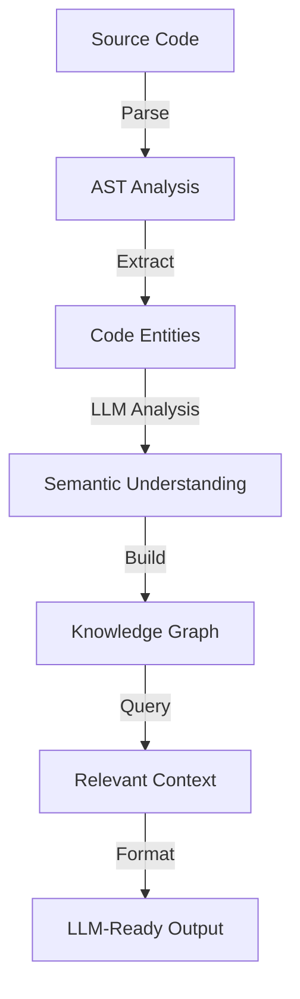

# Coretx - Intelligent Code Context Engine

[](https://www.python.org/downloads/)
[](https://opensource.org/licenses/MIT)
[](https://github.com/psf/black)

> **Coretx** (**Core** Con**tex**t) is an intelligent code analysis engine that builds comprehensive knowledge graphs of your codebase, enabling LLMs to understand and reason about code with minimal context.

## 🎯 Why Coretx?

When working with Large Language Models on code-related tasks, providing the right context is crucial. Too little context leads to incorrect solutions; too much overwhelms the model. Coretx solves this by:

1. **Building a semantic graph** of your entire codebase
2. **Understanding relationships** between code entities across languages
3. **Extracting minimal logical closures** - exactly what the LLM needs to understand the problem
4. **Formatting context optimally** for LLM consumption

## ✨ Key Features

- **🌐 Multi-Language Intelligence**: Analyzes Python, JavaScript/TypeScript, Java, C/C++, HTML/CSS, and more
- **🔍 Semantic Understanding**: Uses LLMs to understand code relationships beyond syntax
- **🎯 Precise Localization**: Identifies exact code sections relevant to bugs or features
- **📊 Rich Visualizations**: Beautiful console output with syntax highlighting and statistics
- **🔧 Extensible Design**: Easy to add support for new languages and frameworks

## ✨ Key Use Cases

- **🐛 Bug Localization**: "Where is the memory leak in our authentication system?"
- **✨ Feature Implementation**: "What files need modification to add OAuth support?"
- **🔍 Code Understanding**: "How does the payment processing flow work?"
- **♻️ Refactoring Impact**: "What will be affected if I change this API?"
- **📚 Documentation**: "Generate docs for the user management module"

## 🚀 Quick Start

### Installation

```bash
# From PyPI (coming soon)
pip install coretx

# From source (development)
git clone https://github.com/Whopus/Coretx.git
cd Coretx
pip install -e .
```

### Basic Usage

```python
from coretx import Coretx

# Initialize with your preferred LLM
Coretx.init(
    parser="auto",
    openai_api_key="your-api-key",
    openai_base_url="https://api.openai.com/v1"  # Optional
)

# Analyze your codebase
result = Coretx.analyze(
    directory="/path/to/your/project",
    recursive=True
)

# Find relevant code for a specific problem
context = Coretx.localize(
    path="/path/to/your/project",
    query="Fix memory leak in user authentication"
)
```

### Command Line Interface

```bash
# Initialize Coretx
coretx init --api-key "your-api-key"

# Analyze a codebase
coretx analyze /path/to/project

# Find relevant code for a problem
coretx locate /path/to/project "Bug in payment processing"

# Export analysis results
coretx export /path/to/project --format html --output report.html
```

## 📚 Core Concepts

### 1. Code Knowledge Graph

Coretx builds a comprehensive graph where:
- **Nodes** represent code entities (classes, functions, modules)
- **Edges** represent relationships (imports, calls, inheritance)
- **Metadata** includes semantic descriptions and embeddings

### 2. Minimal Logical Closure

When you query Coretx, it:
1. Converts your query to embeddings
2. Searches the graph for relevant nodes
3. Expands to include necessary dependencies
4. Returns the minimal set of code needed for understanding

### 3. LLM-Optimized Output

Results are formatted specifically for LLM consumption:
```python
# === file: src/auth/manager.py ===
class AuthManager:
    def authenticate(self, username: str, password: str) -> User:
        # Current implementation with potential memory leak
        
# === file: src/models/user.py (excerpt) ===
class User:
    # Only relevant fields shown
```


## 📋 Example Output

### Analysis Output

When you run `Coretx.analyze()`, you'll see:

```
🔍 Analyzing codebase...
━━━━━━━━━━━━━━━━━━━━━━━━━━━━━━━━━━━━━━━━ 100% 0:00:42

📊 Analysis Complete!

📁 Files Processed: 156
📦 Total Entities: 1,247
🔗 Relationships Found: 3,892

🗂️  Language Breakdown:
   Python      █████████████████░░░  87 files  (55.8%)
   JavaScript  ████████░░░░░░░░░░░  42 files  (26.9%)
   HTML        ███░░░░░░░░░░░░░░░░  15 files  (9.6%)
   CSS         ██░░░░░░░░░░░░░░░░░  12 files  (7.7%)

🏗️  Entity Types:
   Classes     : 124
   Functions   : 486
   Methods     : 637
   Imports     : 892
   Variables   : 2,104

✨ Graph saved to: .coretx/project_graph.json
```

### Localization Output

When you run `Coretx.localize()` for "Fix memory leak in user authentication":

```
🎯 Localizing code for: "Fix memory leak in user authentication"

🔍 Analyzing query...
📍 Finding relevant code sections...
🔗 Building minimal context...

━━━━━━━━━━━━━━━━━━━━━━━━━━━━━━━━━━━━━━━━ 100% 0:00:03

📦 Minimal Logical Closure (4 files, 187 lines)

========================================
📄 FILE: backend/auth/manager.py
========================================
"""Authentication manager with session handling"""
from typing import Optional
from .session_store import SessionStore
from ..models.user import User

class AuthManager:
    def __init__(self):
        self.sessions = {}  # ⚠️ Potential memory leak - sessions never cleared
        self.session_store = SessionStore()
    
    def authenticate(self, username: str, password: str) -> Optional[User]:
        """Authenticate user and create session"""
        user = self._verify_credentials(username, password)
        if user:
            session_id = self._create_session(user)
            self.sessions[session_id] = user  # ⚠️ Memory leak: unbounded growth
        return user
    
    def logout(self, session_id: str) -> bool:
        """End user session"""
        # ⚠️ Missing: del self.sessions[session_id]
        return self.session_store.delete(session_id)

========================================
📄 FILE: backend/auth/session_store.py (excerpt)
========================================
class SessionStore:
    """Redis-backed session storage"""
    def delete(self, session_id: str) -> bool:
        """Remove session from Redis"""
        return self.redis.delete(f"session:{session_id}")

========================================
📄 FILE: backend/models/user.py (excerpt)
========================================
@dataclass
class User:
    id: int
    username: str
    email: str
    last_login: datetime

========================================
📄 PROJECT STRUCTURE
========================================
backend/
├── auth/
│   ├── manager.py        ← Main issue location
│   ├── session_store.py  ← Related component
│   └── __init__.py
├── models/
│   └── user.py          ← Data structure
└── tests/
    └── test_auth.py     ← Relevant tests

🔍 ANALYSIS SUMMARY:
The memory leak occurs in AuthManager where sessions are stored in an 
in-memory dictionary but never removed. The logout() method clears the 
Redis session but not the local dictionary reference.

💡 SUGGESTED FIX:
Add `del self.sessions[session_id]` in the logout method and implement 
a session cleanup mechanism for expired sessions.
```

### Cross-Language Dependency Output

```
🔗 Cross-Language Dependencies Found:

Frontend (TypeScript) → Backend (Python):
├── components/LoginForm.tsx
│   └── api/auth.ts
│       └── POST /api/auth/login → backend/auth/manager.py::authenticate()
│
├── hooks/useAuth.ts
│   └── api/users.ts
│       └── GET /api/users/me → backend/api/users.py::get_current_user()
│
└── services/SessionService.ts
    └── WebSocket /ws/session → backend/ws/handlers.py::SessionHandler

📊 Dependency Statistics:
- API Endpoints: 12
- Shared Types: 8
- WebSocket Channels: 3
```

## 🛠️ Advanced Features

### Multi-Language Project Analysis

```python
# Analyze a full-stack project
analysis = Coretx.analyze(
    directory="/path/to/fullstack-app",
    languages=["python", "typescript", "html"],
    include_tests=True,
    max_depth=5
)

# Find cross-language dependencies
deps = Coretx.trace_dependencies(
    from_file="backend/api/users.py",
    to_language="typescript"
)
```

### Custom Language Support

```python
# Add support for a new language
from coretx.parsers import BaseParser

class RustParser(BaseParser):
    def parse(self, content: str):
        # Implementation
        pass

Coretx.register_parser("rust", RustParser)
```

## 📊 How It Works



1. **Parsing**: Uses Tree-sitter for robust AST parsing across languages
2. **Analysis**: LLMs understand the purpose and relationships of code entities
3. **Indexing**: Semantic embeddings enable intelligent search
4. **Retrieval**: Graph algorithms find minimal necessary context
5. **Formatting**: Output optimized for LLM understanding

## 🔧 Configuration

### Configuration File (coretx.yaml)

```yaml
# LLM Configuration
llm:
  provider: "openai"  # or "anthropic", "local"
  model: "gpt-4"
  temperature: 0.1
  
# Analysis Settings
analysis:
  max_file_size: 1048576  # 1MB
  ignore_patterns:
    - "*.test.js"
    - "__pycache__"
  include_hidden: false
  
# Graph Construction
graph:
  max_depth: 5
  similarity_threshold: 0.7
  include_external_deps: false
  
# Output Preferences
output:
  syntax_highlighting: true
  max_context_size: 8000  # tokens
  format: "markdown"  # or "plain", "json"
```

### Environment Variables

```bash
export CORETX_API_KEY="your-api-key"
export CORETX_API_BASE="https://api.openai.com/v1"
export CORETX_MODEL="gpt-4"
export CORETX_CACHE_DIR="~/.coretx/cache"
```

## 📈 Performance & Limitations

### Performance Characteristics

- **Initial Analysis**: O(n) where n is the number of files
- **Graph Construction**: O(n²) for relationship discovery
- **Query Time**: O(log n) with indexed embeddings
- **Memory Usage**: ~100MB per 10,000 files

### Current Limitations

- Maximum project size: 1M files
- Supported file encodings: UTF-8, ASCII
- Real-time analysis not yet supported
- Limited support for binary files

## 🤝 Contributing

We welcome contributions! See our [Contributing Guide](CONTRIBUTING.md) for:
- Code style guidelines
- Testing requirements
- PR process
- Adding language support

## 📚 Examples & Tutorials

- [Analyzing a Django Project](examples/django-analysis.md)
- [Finding Security Vulnerabilities](examples/security-scan.md)
- [Refactoring with Coretx](examples/refactoring-guide.md)
- [Custom Parser Development](examples/custom-parser.md)

## 🐛 Troubleshooting

### Common Issues

**Issue**: "No module named 'tree_sitter_python'"
```bash
# Solution: Install language parsers
pip install tree-sitter-languages
```

**Issue**: Large projects taking too long
```python
# Solution: Use incremental analysis
Coretx.analyze(
    directory="/large/project",
    incremental=True,
    cache_dir=".coretx-cache"
)
```

## 📄 License

MIT License - see [LICENSE](LICENSE) for details.

## 🙏 Acknowledgments

Built with:
- [Tree-sitter](https://tree-sitter.github.io/) - Universal parser
- [NetworkX](https://networkx.org/) - Graph algorithms
- [Sentence Transformers](https://www.sbert.net/) - Semantic search
- [Rich](https://github.com/Textualize/rich) - Beautiful terminal output

## 📞 Support & Community

- 📖 [Documentation](https://coretx.readthedocs.io)
- 💬 [Discord Community](https://discord.gg/coretx)
- 🐛 [Issue Tracker](https://github.com/Whopus/Coretx/issues)
- 🎥 [Video Tutorials](https://youtube.com/coretx)
